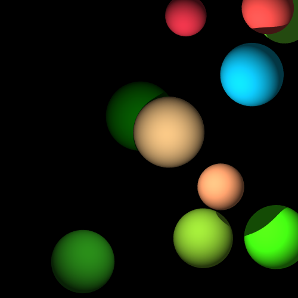
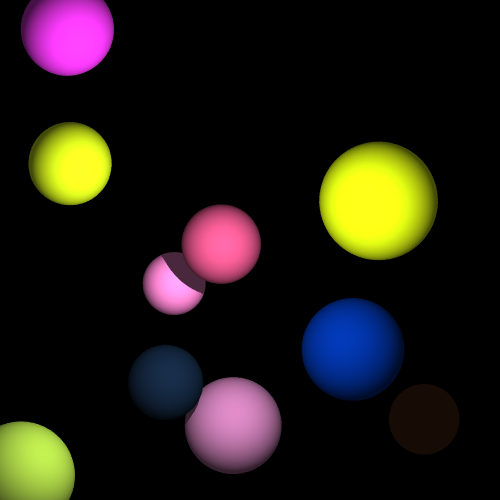
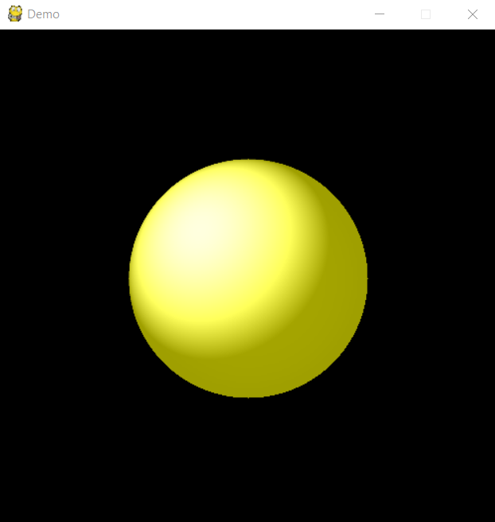

# resurgence_renderer
resurgence_renderer is a simple to use 3D renderer that can be easily extended using python.
The renderer is powered by raytracing, and pygame is utilized for the window and displaying of the final image.
It is quite lightweight and easy to use, although it can be quite slow.
I created it as a basic project to learn raytracing, and right now only has the ability to render spheres.
This project is licensed under the MIT License and authored by Rachit Kakkar.

My process to create it, as well as an explanation of how it works, can be found at the following blog post: https://rachitkakkar.github.io/projects/my-python-raytracer/

# Demonstration




The code for generating similar images can also be found in the above blog post.

# Help
Documentation can be found in docs/docs.text

# Examples
**Examples can be found in the examples folder** \
**The images from those examples can be found in the images folder**

This is an example output (can be found under images/output.png):


This is the code used to generate the output (can be found under examples/output.pyw):

```python
from resurgence_renderer import Sphere, Vector3, Light, Scene

objects = [Sphere(Vector3(250, 250, 150), 120, Vector3(255, 255, 0), 0.5, 0.0001, 0.7)]
lights = [Light(Vector3(250, 250, -200), Vector3(255, 255, 255))]
camera = Vector3(0, 0, 0)

scene = Scene(500, 500, "Demo", 1000, camera, objects, lights)
scene.ray_trace()

while True:
    scene.update()
```
